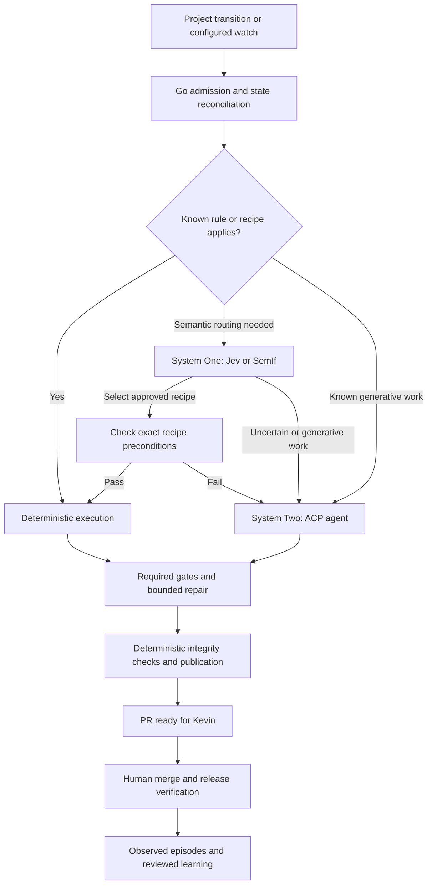

# sofa: personal software factory plan

Planning baseline: September 22, 2026. This document describes proposed implementation, not working software. Research covered primary documentation and source; live provider integrations have not been exercised.

The detailed designs are [lifecycle and quality gates](docs/lifecycle.md), [runtime and watch loops](docs/runtime-and-watches.md), [memory and dreaming](docs/memory.md), and [System One research and integration](docs/system-one.md). This plan ties those contracts together.

For implementation, use the [bounded milestone specifications and goal prompts](docs/milestones/README.md). They split this roadmap into independently verifiable goals and define the evidence needed to complete each one.

## 1. Product decisions

`sofa` is a public toolkit of reusable GitHub Actions workflows/actions, backed by Go code. Each consuming repository operates its own factory and holds its own credentials. There is no central controller repository or required external database.

- Support Kevin's personal public and private GitHub repositories first.
- Cover intake, discovery/specification, backlog preparation, implementation, independent validation, release observation, maintenance, and learning.
- Discovery drafts a specification; Kevin approves its revision before Backlog. Moving an issue-backed Project card to **Ready** separately authorizes delivery.
- Configured watches may open bounded fix PRs under explicit standing policies without a manual Ready transition. Kevin remains the merge authority for every path.
- Run on fresh GitHub-hosted Linux runners. Planning, implementation, testing, review, and bounded repairs proceed automatically after admission.
- Ship ACP integrations for Copilot, Codex, and Claude. Agent, model endpoint, authentication, and per-role selection are independently configurable within a tested compatibility matrix.
- All custom implementation, including clients, adapters, orchestration, and credential helpers, is Go. Third-party agent/model runtimes may use other languages.
- Use deterministic execution first, System One decisions throughout the lifecycle where useful, and generative agents for work requiring reasoning or generation.
- Retain semantic, episodic, and procedural memory; use bounded dreaming to propose evaluated improvements through review.
- Keep the work-source interface independent of GitHub Projects so Linear and other boards can be added later. Their adapters are outside the first release.

Planning defaults where Kevin has not specified a preference: Jev API for configured System One execution, and API/router authentication for Codex initially. If System One is unavailable, routing uses configured static profiles and retrieval retains deterministic lexical results; unresolved diagnosis or generative work can use the configured LLM within its budget. Persistent Codex subscription-session management is a later addition; these defaults remain adjustable.

## 2. The three execution layers

Go owns lifecycle transitions, authorization, action budgets, and external publication; agents operate bounded workspace tools inside that policy. A task does not have to visit all three layers. Known generative work can go directly to an ACP agent after deterministic admission; there is no mandatory classifier call before every prompt.



| Layer | Responsibilities | Result |
| --- | --- | --- |
| Deterministic Go | Authorization, deduplication, state transitions, parsing structured CI results, timeouts, quotas, exact recipes, tests, publication, and status templates | A verified transition, completed recipe, or explicit unresolved question |
| System One | Route model/effort, supervise progress, categorize failures and select fixers, navigate test scenarios, rank memory, evaluate semantic preferences, and identify reusable lessons | A bounded typed judgment, provider-supported scores/confidence, and an abstain path |
| System Two | Novel planning, code changes, diagnosis, and substantive code review | Proposed changes and evidence, validated by Go and repository checks |

**Zero-inference operation is a testable property.** Idle polls, duplicate deliveries, status synchronization, known infrastructure handling, and fully covered recipes make no model calls. System One still consumes inference resources; runner execution also has a cost even when no tokens are used.

Recipes have explicit inputs, applicability checks, versioned behavior, and validation. Initial examples are configured formatters/fixers, generated-file refreshes, and narrow repository maintenance transformations. A formatter repairing a novel feature does not make the feature itself a recipe.

When repeated agent work reveals a reusable procedure, propose a normal PR adding Go recipe logic, positive/negative fixtures, idempotency checks, and failure handling. Kevin reviews it before release. Agent transcripts or cached model answers never automatically become trusted executable policy. This applies the engineering principle behind Kelsey Hightower's [Zero Token Architecture talk](https://2026.platformcon.com/sessions/zta-zero-token-architecture-nyc); the talk's metadata and official abstract were verified, not its playback.

### System One implementation

Use a Go `DecisionProvider` interface with a batch of state, named questions, and bounded choices. Results include typed selections/scores, provider-supported distributions or confidence, model revision, and input digest; do not invent probability fields for result types that lack them. The Go decision engine validates responses and owns thresholds, budgets, and escalation.

- **Jev:** direct HTTP client for TypeSafe's documented API; pin the tested model revision. Batch independent questions sharing the same state. [TypeSafe API](https://docs.typesafe.ai/api)
- **SemIf:** Go invokes the upstream `semif-score` CLI with JSONL input/output. Pin the external runtime, model weights, tokenizer, and checksums. Provide an optional CPU profile; measure cold setup, warm latency, memory, disk, and decision quality on actual runners before enabling it. Its CPU backend exists, but published GPU timings do not establish hosted-runner performance. [SemIf](https://github.com/TheoLeeCJ/SemIf)
- Include an `insufficient` outcome. Invalid output, missing evidence, exhausted retries, or unsupported input causes abstention and the configured escalation.
- Establish thresholds on labeled sofa examples, separately for each question and provider/model revision. Initially run uncalibrated decisions in advisory mode. Confidence is not proof of correctness. [Jev confidence](https://docs.typesafe.ai/confidence), [SemIf calibration](https://github.com/TheoLeeCJ/SemIf/blob/master/docs/CALIBRATION.md)
- System One may recommend a route among already permitted choices. It never supplies executable commands, chooses credential scope, authorizes a user, waives failed checks, or permits a forbidden operation.
- Cache only exact semantic inputs with question, policy, provider, and model versions in the key. Recheck current GitHub state and authorization independently; a cache is never the authority for a side effect.

Use Jev as a semantic decision layer throughout execution, not solely at intake. Start with evaluated stage/turn model-and-effort selection, unfamiliar-failure routing, memory ranking, and bounded exploratory testing. Keep deterministic gates and action executors authoritative. Current ACP can expose model/thought-level configuration, but it has no universal hook before every internal model call; per-call routing requires a separately tested harness proxy. Browser controllers expose observed targets and safe operations to text-only Jev, with independent assertions and visual models where needed. The [System One design](docs/system-one.md) evaluates concrete routing, browser, supervision, and memory implementations, including weak or negative outcome evidence.

## 3. Repository operation and durable state

Each downstream repository installs a small caller workflow and `.sofa.yml`. The caller handles scheduled/manual events and calls `sofa`'s reusable workflows at an immutable, tested commit during canary qualification; `@v1` is reserved for after release qualification. An ordinary schedule/manual invocation reconciles; a dispatch carrying a ledger attempt ID invokes the worker. Dispatch inputs identify existing admitted work and cannot authorize new work by themselves. Workflow/action inputs can select profiles or override nonsecret profile settings. Defaults live in versioned configuration on the trusted default branch.

The normal lifecycle is:

**Inbox → Discovery → Spec Review → Backlog → Ready → Building → Verification → Review → Release → Done.** Use Product and Delivery views to keep the daily board focused. Map names onto the built-in Project Status field; retain Blocked/Deferred/Cancelled outcomes and reasons in fields/ledger so lifecycle position remains visible. The [lifecycle design](docs/lifecycle.md) defines each handoff and approval boundary. Other custom-field triggers are outside initial intake support.

1. Reconcile approximately every ten minutes, offset from the hour; provide manual reconciliation as well. Scheduled execution is best effort.
2. Query configured Projects, considering only real Issues belonging to the calling repository. Draft cards and PR cards are outside initial intake support.
3. For human-admitted delivery, verify a unique active item in the configured private Project with current Ready status. Trust the Project's restricted write ACL as the authorization boundary; do not grant the admission credential Project write or let factory automations set Ready. Freeze the issue specification and Ready field revision when first observed, reject edits after Ready, and revalidate both before side effects. GitHub did not expose a status-change event for the first canary item, so do not confuse field creator with mover or claim actor proof. A watch instead supplies its trusted standing policy revision, evidence, permitted change class, and budget; neither path may impersonate the other. [GitHub Project schema](https://docs.github.com/en/graphql/reference/projects), [Project access controls](https://docs.github.com/en/issues/planning-and-tracking-with-projects/managing-your-project/managing-access-to-your-projects)
4. Snapshot the admitted issue revision, relevant content digest, base commit, configuration revision, and execution profile. Subsequent material source edits require re-admission. Issue prose cannot modify policy or supply credential-bearing endpoints.
5. Commit a pending attempt before dispatching a worker. The worker claims that attempt atomically; duplicate or superseded deliveries exit without inference.
6. Execute an applicable recipe or the configured planning/implementation roles, then a deterministic gate plan. Dispatch applicable independent review, blackbox acceptance, security, and other validation roles explicitly. Missing requirements or unavailable required specialists block readiness. Generative reviews use fresh sessions; a different model is configurable, not mandatory.
7. Publish through a separate trusted job. Reconcile real CI results and owner review feedback, using the exact PR head SHA. Repairs update the same active PR within the persisted budget.
8. Mark the PR ready only after required gates for the current candidate pass. Missing, failed, stale, or inconclusive evidence cannot count as passing; Not Applicable requires a policy-backed reason. Approved recipes may use deterministic review criteria. After human merge, observe configured release/deployment and smoke checks before Done; repositories without a release path use default-branch acceptance. Closing without merge does not count as completion, and observing deployment does not grant production-write authority.

Keep a compact, versioned JSON ledger on an orphan `sofa-state` branch. It contains identifiers, source/config digests, admission proof, loop/version, phase, run ownership/generation, PR/head SHA, checkpoints, and cumulative retry/resource counts—no secrets, issue bodies, source bundles, or transcripts. Separate episodic records use their own namespace and content policy. Comments and check runs are projections; artifacts are temporary transport with explicit expiry.

Update the ledger with commits parented to the observed state head and non-forced Git reference updates. A concurrent loser reloads and retries. Use an isolated deterministic job's `GITHUB_TOKEN` for routine state writes, avoiding recursive push-triggered CI; publication-phase ledger updates use the publisher credential. Agent jobs have no state-write credential. [Git reference updates](https://docs.github.com/en/rest/git/refs#update-a-reference)

Reconciliation recovers missed dispatch, canceled/failed runs, and interrupted publication. Verify the owning run has stopped before reclaiming work; timeout alone cannot replace an active worker. Immediately before each publication step, recheck ledger ownership/generation, source/configuration digests, and expected branch head. Revalidate admission by kind: human work retains its frozen specification and same Ready field revision, with current board state consistent with its tracked phase; watch work retains its current standing grant and qualifying evidence, without requiring a Ready event. Unexpected human changes pause automated writes. Never force-push over a human change or start another PR merely because delivery was repeated. GitHub does not provide one transaction spanning Project status, Git writes, and PR updates; a cancellation racing an already-started write stops subsequent steps and leaves any resulting PR in draft for reconciliation.

Default limits: one active code-writing delivery item per repository, 45 minutes per attempt, two repair attempts, and two transient infrastructure retries. Independent gate jobs may run in bounded parallelism. Persist aggregate counters across workflows and child tasks. Authentication failures block; quota exhaustion defers. Cancellation, material scope changes, or revocation of the authorizing watch policy take effect at the next live enforcement check. These limits are configurable.

### Runtime tradeoffs and recovery

Standard hosted Actions compute is free for public repositories, with finite runtime/concurrency and separate model costs; private repositories have allowances and paid overage, and larger runners remain charged. Actions supplies disposable workers, not durable agent sessions. Use phase checkpoints, idempotent claims, persisted dispatch intent, ownership generations, and reconciliation to recover work after failure. Unsaved local progress can still be lost. [Actions billing](https://docs.github.com/en/billing/concepts/product-billing/github-actions), [limits](https://docs.github.com/en/actions/reference/limits)

Use one configurable ticker for all due loops. Offset schedules, coalesce missed windows, and wake on relevant events/manual dispatch. Default polling remains ten minutes, with an hourly economy preset for private repositories. Keep evidence summaries outside expiring artifacts; never use caches as authoritative state. An Actions-only system cannot alert during its own complete outage, so document that limitation and leave an optional independent heartbeat integration. Runtime dispatch/observation/cancellation contracts stay separate from loop policy for a future executor. The [runtime document](docs/runtime-and-watches.md) provides verified constraints and mitigation details.

### Scheduled loops and standing authority

Implement a common Go loop registry with detector, evidence contract, applicability, cadence, authority, budget, deduplication, and recovery policy. Ship reconcile, discovery, delivery, gatewatch, nightwatch, bugwatch, security/dependency watch, tastewatch, ratchetwatch, and dreaming profiles. Mandatory delivery gates run by dependency/event, not merely on a nightly schedule.

Cheap deterministic observation precedes agent activation. A watch may issue findings or open bounded fix PRs only within its configured grant; broader work becomes Discovery. Findings are fingerprinted and updated in place. Default caps are three new findings per watch execution and one open improvement PR per ratchet/dreaming watch, with delivery prioritized over optional maintenance. No-change runs stay quiet and use no inference. See the [loop catalogue](docs/runtime-and-watches.md) for cadence and policy specifics, including Warren's experience retiring noisy scheduled patrols.

### Memory and dreaming

Separate stores by meaning and authority:

| Memory | Storage | Ingestion and use |
| --- | --- | --- |
| Episodic | `episodes/` on the caller's `sofa-state` branch | Automatically record observed stage outcomes, attempts, versions, usage and evidence; hypotheses remain marked as unverified |
| Semantic | `.sofa/memory/semantic/` on the caller's default branch | Reviewed domain knowledge/constraints with source anchors, applicability and freshness |
| Procedural | `.sofa/skills/` plus generic skills in the sofa release | Reviewed procedures with validation; exact repeatable operations graduate to tested Go recipes |

Retrieve by repository/visibility/version filters, exact identifiers, and deterministic lexical search first. Optionally rerank a permitted shortlist with Jev. Sofa-managed recall supplies at most 4,000 tokens initially, with bounded on-demand expansion to 8,000 per stage; native harness reads remain subject to the separate overall agent budget. Trusted policy is loaded separately. Evidence expiry, conflicting facts, supersession, and privacy boundaries are explicit; no model-generated memory can grant authority.

Weekly dreaming processes new work outcomes and later feedback/correction events, up to 50 affected episodes per batch and 30 minutes, and proposes at most three evidence-linked improvements in one consolidation PR. Its watermark follows event revisions; dreaming/evaluation housekeeping does not trigger another dream by itself. Compare current/candidate/no-memory behavior on held-out cases and include the cost of dreaming/evaluation. Reviewed improvements may update knowledge, skills, tests, recipes, or routing proposals; protected configuration changes follow the owner-handled proposal path below. There is no required vector database. See the [memory design](docs/memory.md) for schemas, retrieval, retention, poisoning defenses, and promotion.

## 4. ACP harnesses, model endpoints, and Go dependencies

ACP controls the coding harness. The harness calls its model endpoint. These are separate interfaces:

`sofa Go client → ACP over stdio → selected harness → native provider or configured router`

A profile contains `agent`, `provider`, `base_url`, `wire_api`, `model`, optional supported reasoning effort, `auth`, and execution limits. Authentication explicitly selects a native subscription or an endpoint credential. Per-role profile selection covers discovery, planning, implementation, review, blackbox testing, security, diagnosis, supervision, and dreaming. Roles can share a profile while retaining separate sessions and permissions. Ship named presets while allowing trusted custom endpoints with a supported wire protocol.

For example, this opt-in profile selects the Codex harness with OpenRouter's free router; it does not use ChatGPT subscription authentication:

```yaml
profiles:
  codex-free:
    agent: codex
    provider: openrouter
    base_url: https://openrouter.ai/api/v1
    wire_api: responses
    model: openrouter/free
    auth:
      kind: provider_key
      secret: OPENROUTER_API_KEY
    allow_paid_fallback: false
roles:
  implementation: codex-free
```

The caller must explicitly pass the named secret; a reference in configuration does not grant access to it. Unsupported agent/endpoint/model combinations fail diagnostics rather than changing harnesses or billing sources automatically.

| Harness | ACP integration | Router protocol and first-release targets |
| --- | --- | --- |
| Copilot | Native `copilot --acp --stdio` | Documented BYOK Chat Completions configuration; OpenRouter and FreeLLMAPI targets |
| Codex | `@agentclientprotocol/codex-acp`, using Codex App Server | Responses API; OpenRouter including `openrouter/free`, and text-only FreeLLMAPI targets |
| Claude | `@agentclientprotocol/claude-agent-acp`, using Claude Agent SDK | Anthropic Messages; OpenRouter with Claude models. Non-Claude/free-pool routing remains explicitly experimental |

These are integration targets, not claims of completed runtime testing. Each advertised combination must pass the compatibility suite before release. A generic “OpenAI-compatible” hostname is insufficient: Responses, Chat Completions, and Anthropic Messages have different contracts. [Copilot BYOK](https://docs.github.com/en/copilot/how-tos/copilot-cli/customize-copilot/use-byok-models), [Codex configuration](https://learn.chatgpt.com/docs/config-file/config-reference), [Claude gateways](https://code.claude.com/docs/en/llm-gateway)

Use each harness directly with the chosen endpoint; do not require OpenCode as an intermediary. Router presets supply protocol-specific URL roots. OpenRouter documents [direct Codex configuration](https://openrouter.ai/docs/cookbook/coding-agents/codex-cli). FreeLLMAPI refers to [tashfeenahmed/freellmapi](https://github.com/tashfeenahmed/freellmapi); connect to a user-provided instance rather than operating a new gateway inside sofa.

Free profiles must not fall back to paid models or another authentication source. Validate tool/streaming capabilities and context limits; handle changing availability and rate limits. Record actual model/provider identity when exposed, otherwise record it as unavailable. Model selection is not authorization to send private repository content to arbitrary providers: enabled endpoints and data-routing policy come from trusted repository configuration.

Start with Copilot as the default profile for all generative roles, with a fresh review session. Native Copilot can use Actions authentication where available; Claude supports subscription tokens. Codex API/router authentication is the provisional first-release default. Codex account-auth CI requires private trusted automation, serialized refresh handling, and durable secret writeback, so it is a separate capability rather than a copied static secret. [Copilot Actions auth](https://docs.github.com/en/copilot/how-tos/copilot-cli/use-copilot-cli-in-actions), [Claude authentication](https://code.claude.com/docs/en/authentication), [Codex account CI](https://learn.chatgpt.com/docs/auth/ci-cd-auth)

### Go ACP library evaluation

Use **`github.com/caelis-labs/acp-go-sdk@v1.4.0`**, as selected by Kevin, behind an internal interface and with real-agent compatibility as a release gate. Go ACP libraries are community-maintained. The referenced “Compare Go ACP Libraries” task exposed only its research-start acknowledgment when inspected, so no additional report conclusions were available. [ACP library catalog](https://agentclientprotocol.com/libraries/community)

| Candidate | Assessment |
| --- | --- |
| [Caelis](https://github.com/caelis-labs/acp-go-sdk) | Best current fit: stable ACP v1 API, bounded transport, optional capabilities, subprocess lifecycle controls, and reported official-SDK interoperability checks. Young project; evaluate source and test the actual agents. |
| [Coder](https://github.com/coder/acp-go-sdk) | Established alternative with a small dependency footprint; latest inspected release was v0.13.5 and tracks an older schema. Credible replacement if required, not a second runtime implementation. |
| [Spachava](https://github.com/spachava753/acp-sdk) | Useful handler/transport abstractions, but pre-1.0 and unstable-schema generation make it a less conservative boundary. |
| [Ironpark](https://github.com/ironpark/acp-go) | Convenient process/middleware APIs; release discipline and schema lag make it less suitable here. |
| [Eino](https://github.com/eino-contrib/acp) | Useful remote/server transports; broader dependency surface than this stdio client needs. |

Keep protocol types private to the adapter. Negotiate capabilities, handle permissions and streaming, distinguish turn cancellation from request cancellation, and terminate the full contained agent process on timeout. Pin agent adapters and their compatible harness versions together.

Use ordinary reusable Actions workflows and the Go binary as the implementation foundation. GitHub Agentic Workflows informed the execution/publication separation, but its compiler is not an additional required public interface for sofa.

## 5. Security, distribution, and public interfaces

**Caller-owned execution is the primary credential boundary.** Calling public sofa workflows does not expose credentials stored in another caller or in the sofa repository. Pass explicitly named secrets, not `secrets: inherit`. Bind factory operations to the calling repository; no arbitrary cross-repository target in the first release. [GitHub workflow reuse](https://docs.github.com/en/actions/how-tos/reuse-automations/reuse-workflows)

Separate jobs and credentials:

- **Admission/reconciliation:** personal Projects credential, read access to task/run/PR metadata, and controlled ledger writes. Each repository needs Projects access because polling is decentralized.
- **Execution:** source checkout, selected model authentication, disposable work directories, and narrowly scoped read permissions. No Projects PAT, GitHub App private key, secret-write token, or deployment credential.
- **Integrity/publication:** validate artifact provenance, expected repository/base/head/generation, paths, patch contents, and secret scanning; mint a repository-scoped GitHub App installation token to publish branches/PRs. Do not execute proposed code or repository hooks in this job.

Run the whole agent in a restricted non-root container on the disposable runner. Mount only the workspace and required temporary directories, never the Docker socket or host home. Checkouts use `persist-credentials: false`; execution workspaces contain no token-bearing Git configuration or inherited credential helpers. Apply an environment allowlist and configured network policy. ACP permission callbacks supplement this boundary; they do not constrain every harness-native tool. Provider credentials accessible to a harness remain sensitive—do not claim zero credential-exfiltration risk.

Every profile gets isolated auth/config state and only its selected credential. Native subscription profiles reject endpoint overrides. Router profiles require explicit endpoint authentication and clear incompatible native login state. A subscription credential must never be forwarded to OpenRouter or a custom gateway merely because its hostname changed.

Never execute fork-controlled code in a privileged trigger path. Product builds, tests, and preview processes receive no factory/provider secrets; agent specialists receive only their selected model credential in a separate controlling environment. Privileged deployment jobs require their own protected environment. Ordinary fix and dreaming grants do not permit publishing workflow/action definitions, credentials, admission rules, gate thresholds, or provider/data-routing policy. Such improvements are prepared as patch/specification proposals for owner handling; a dedicated governance publication path is outside the initial release. Repository instructions and plugins cannot override trusted execution policy.

Sensitive findings in public repositories require an explicitly configured private reporting destination. Keep raw vulnerability details out of public issues, state, logs, and artifacts; publish only an approved redacted summary. Without a private destination, block sensitive publication and report the need for private handling without disclosing the finding.

Release immutable patch versions and move a protected `v1` major tag only after canary checks. Consumers of `@v1` receive compatible changes on their next run. Breaking caller/config changes require `v2`; exact-SHA pinning remains available. Resolve bundled actions/binaries from the reusable workflow's own tested release commit, and pin external actions/dependencies. Protect release credentials because a compromised shared release can affect all trusting callers. [GitHub release guidance](https://docs.github.com/en/actions/how-tos/create-and-publish-actions/using-immutable-releases-and-tags-to-manage-your-actions-releases)

Public interfaces to implement:

- Reusable **reconcile** and **work** workflows, plus small setup/run actions invoking the Go binary.
- CLI commands for initialization, configuration/credential diagnostics, reconciliation, and execution. Live model probes are explicit so ordinary diagnostics need not consume inference.
- Versioned `.sofa.yml`: lifecycle/status mapping, human and standing-watch authorization, gate plans, checks, recipes, System One routing, role profiles, endpoints, memory, credential references, and limits. Never secret values.
- Workflow/action inputs for profile selection and explicit agent/provider/model/endpoint overrides; precedence is explicit trusted inputs, repository configuration, then versioned defaults.
- Stable Go boundaries for work sources, loop policies, gates, runtime execution, recipes, decision providers, ACP harness adapters, memory, and state storage. Reports include outcome, PR URL, evidence, layer used, versions, duration, retries, and provider usage when available.

## 6. Delivery and acceptance

Implement in this order, with all required harness integrations included before calling the first release complete:

1. **Deterministic foundation:** Go CLI/configuration, loop/gate contracts, workflow packaging, fake providers, state ledger, recipes, and replay tests. Prove no-op and recipe paths make zero model calls.
2. **Lifecycle vertical slices:** Discovery → specification approval → Backlog; Ready/standing-policy admission → isolated delivery → exact-head validation → human merge → release observation. Demonstrate recovery in a disposable consumer repository.
3. **ACP and endpoint matrix:** Copilot, Codex, Claude; native authentication where included; direct router configurations; explicit unsupported/experimental combinations. Add required independent reviewer, blackbox, and security roles.
4. **System One:** Jev/SemIf providers, stage/turn model-and-effort routing, failure-to-fixer routing, bounded browser exploration, semantic review, memory ranking, calibration, and resource/outcome measurements. Per-internal-call routing remains a later harness-specific extension.
5. **Memory and watches:** automatic episodes, reviewed semantic/skill records, deterministic retrieval, scoped maintenance grants, deduplicated watch results, and evaluated dreaming proposals.
6. **Release hardening:** adversarial inputs/memory, interruption and retention recovery, two consumer canaries, compatible `@v1` updates, rollback, and installation documentation.

Required acceptance scenarios:

- Idle, duplicate, malformed, unauthorized, and already-completed events use zero inference and cannot claim work.
- Discovery cannot approve its own specification; autonomous watches cannot exceed their standing scope or set a human delivery item's Ready status.
- Repeated delivery, overlapping polls, stale workers, interrupted state commits, and failed publication do not duplicate PRs or overwrite human work.
- Each recipe passes applicability, negative-case, idempotency, and validation tests; repeated solved work bypasses both model layers.
- Each System One provider handles abstention, invalid distributions, unknown options, prompt injection, timeouts, and quota errors. Report accepted-decision error and abstention rates separately.
- Each supported ACP profile initializes, edits a fixture, executes a permitted command, streams updates, continues across turns, denies prohibited access, cancels, and reaps processes.
- Router tests verify the actual destination, wire protocol, auth source, tool behavior, context limits, and free-only policy. Endpoint changes never reuse subscription credentials.
- Malicious issue text, patches, symlinks, hooks, artifacts, and repository agent configuration cannot obtain Projects/App/publisher credentials or bypass publication policy.
- Review/CI readiness is tied to the current PR head; failing, missing, or stale checks cannot be interpreted as passing by a model.
- Required specialists must run and produce current evidence; browser decisions cannot self-certify success, and failed release verification cannot become Done.
- Memory retrieval enforces scope, freshness, provenance and context budgets; poisoned hypotheses cannot become policy. Empty dreaming uses zero inference and evaluated improvements require review.
- Delayed/dropped schedules, killed workers, revoked grants and expired artifacts recover without duplicate actions or reset budgets.
- Public third-party callers cannot access Kevin's credentials. Public/private consumers both receive a tested compatible `@v1` update without copied implementation changes.

Report layer distribution, zero-inference completion rate, time to review-ready/released work, gate escapes, repair success, watch finding quality, memory usefulness, and available provider usage. Include observation, dreaming and evaluation overhead in savings comparisons. Keep cost unknown when a provider does not report it; subscription or free-tier access is not evidence of zero resource use.
